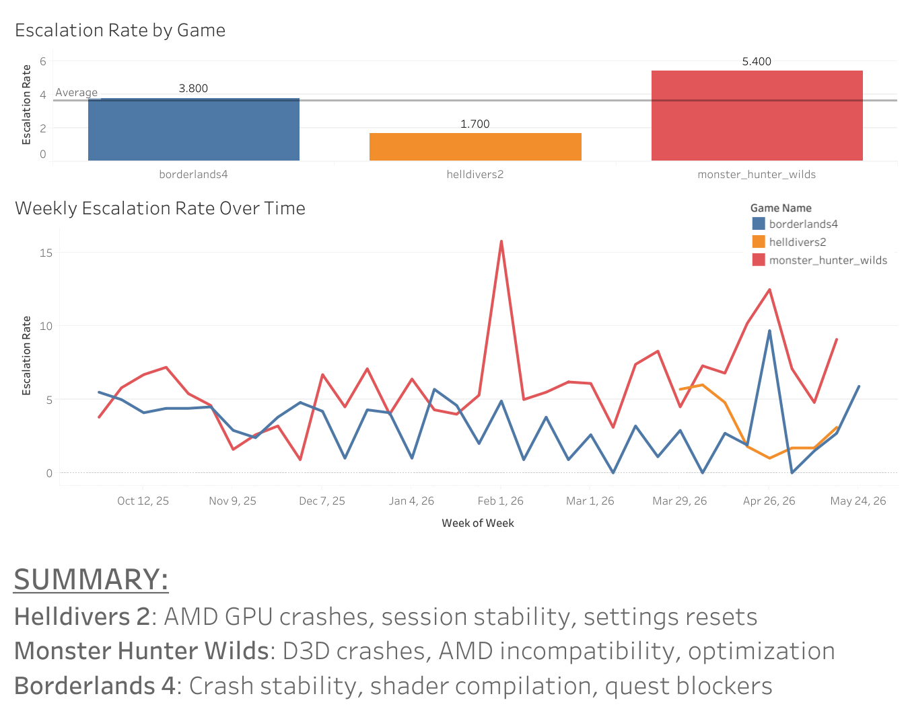

# Steam Review Classifier & Product Brief Generator

An end-to-end data pipeline that collects Steam game reviews via API, stores and analyzes them in Google BigQuery, classifies technical escalations from player venting using zero-shot NLP, and generates actionable product briefs for game developers using the Gemini API.

Built as a portfolio project to demonstrate full-stack data science work: data engineering, cloud warehousing, NLP classification, LLM integration, and data visualization.

---

## The Problem

Steam game reviews are publicly available but overwhelming in volume. A product team has no easy way to distinguish genuine bug reports that need engineering attention from players venting frustration.

This pipeline automatically makes that distinction and surfaces actionable insights — so a PM can open the dashboard on Monday morning and immediately know where to direct their engineering team.

**Escalation:** *"Game crashes every time I open the map, lost 4 hours of progress"* → engineering needs to see this

**Venting:** *"Developers are greedy and ruined this franchise"* → not actionable

---

## Pipeline Architecture

```
Steam API
    │
    ▼
Python (Requests + Pandas)
Cursor-paginated data collection, cleaning, feature engineering
    │
    ▼
Google BigQuery
Cloud data warehouse — raw reviews + SQL analytics
    │
    ├─────────────────────────────────────┐
    ▼                                     ▼
SQL Analytics Layer              Zero-Shot Classification
Sentiment trends,                facebook/bart-large-mnli
patch comparisons,               Escalation vs Venting
escalation rates                 (Google Colab T4 GPU)
    │                                     │
    └──────────────────┬──────────────────┘
                       ▼
                 Gemini API
          Per-game product brief
               generation
                       │
                       ▼
            Tableau Dashboard
    Sentiment trends, escalation rates,
         AI-generated briefs
```

---

## Tech Stack

| Category | Tool |
|---|---|
| Data Collection | Python, Requests, Steam Web API |
| Data Processing | Pandas |
| Cloud Warehouse | Google BigQuery |
| NLP Classification | Hugging Face (facebook/bart-large-mnli) |
| LLM Integration | Google Gemini API (gemini-3.5-flash-lite) |
| GPU Runtime | Google Colab (T4 GPU) |
| Visualization | Tableau |
| IDE | Cursor |

---

## Games Analyzed

Games were selected based on **active, ongoing technical complaints** in recent reviews — not historical launch issues — to ensure the pipeline surfaces actionable current bugs, not resolved ones.

| Game | Reviews Collected | Escalation Rate |
|---|---|---|
| Helldivers 2 | ~10,000 | 11.7% |
| Monster Hunter Wilds | ~10,000 | 24.9% |
| Borderlands 4 | ~10,000 | 26.6% |

---

## Key Results

- **30,000+ reviews** collected across 3 games via cursor-paginated Steam Web API
- Raw reviews warehoused in **Google BigQuery** with SQL analytics layer for sentiment trends and patch comparisons
- **611 high-confidence escalations** identified using zero-shot classification (confidence ≥ 0.65)
- Zero-shot classification with `facebook/bart-large-mnli` run on **Google Colab T4 GPU**
- **Per-game product briefs** generated by Gemini API, surfacing top engineering priorities with severity assessments

---

## Dashboard



---

## Sample Product Brief Output

### Helldivers 2

**Top 3 Engineering Priorities:**

1. **Critical — PC Hardware Hard-Crashes & Black Screens**
Persistent crashes affecting AMD RDNA3 / RX 7600/7600XT GPUs, infinite black screens on launch, and complete PC lock-ups tied to recent patches. Active for 12+ months.

   *Action: Isolate and rollback conflicting memory management calls introduced in recent builds for AMD RDNA3 architectures; establish a dedicated hotfix branch with affected community hardware testers.*

2. **High — Session Stability & Cross-Play Crashes**
Frequent crashes to desktop and disconnects during gameplay, exacerbated by cross-play features and recent content updates.

   *Action: Implement enhanced telemetry logging for cross-play network handshakes to identify memory leaks causing mid-match CTDs.*

3. **Medium — Settings & Configuration Resets**
Post-patch regressions where graphics settings, key bindings, and armor selections reset to default on launch.

   *Action: Audit local save-file write permissions and configuration initialization routines to ensure settings persist across patches.*

---

### Monster Hunter Wilds

**Top 3 Engineering Priorities:**

1. **Critical — Frequent Client Crashes (CTD & Fatal D3D Errors)**
Random crashes to desktop accompanied by `DXGI_ERROR_DEVICE_REMOVED`, occurring during loading screens and specific biomes (Forest/Wyveria).

   *Action: Deploy emergency telemetry hotfix to capture stack traces and implement fallback memory-allocation safety net for high-stress areas.*

2. **Critical — AMD GPU Incompatibility & Driver Timeouts**
Persistent crashes on AMD 6000 and 9000 series cards regardless of driver version, BIOS tweaks, or lowered settings.

   *Action: Establish dedicated strike team with AMD to isolate 9000-series driver handshake failure and push compatibility workaround in next hotfix.*

3. **High — Sub-par PC Optimization & Visual Artifacts**
Heavy reliance on upscaling to achieve playable frame rates on high-end hardware, native resolution blurriness, and poor texture streaming.

   *Action: Audit TAA and upscaler pipelines to resolve native blurriness and optimize asset streaming to reduce reliance on mandatory High Quality Texture DLCs.*

---

### Borderlands 4

**Top 3 Engineering Priorities:**

1. **Critical — Crash Stability & Save Corruption**
Frequent crashes during map loading, biome transitions, and menu usage, with associated save-file corruption causing complete data loss.

   *Action: Deploy emergency hotfix with increased error logging on memory allocation during zone transitions and implement auto-backup save system.*

2. **Critical — Shader Compilation & Launch Failures**
Infinite loops and hangs at 99% during shader compilation on startup, blocking players from launching the game entirely.

   *Action: Pre-compile common shader caches into the initial download package and bypass mandatory in-engine compilation if a valid cache already exists.*

3. **High — Mission & Scripting Progression Blockers**
Soft-locks during quests where enemies or bosses fail to spawn, forcing players to restart repeatedly.

   *Action: Implement fallback state machine for active quests that forces objective markers to reset and respawn missing entities if the player re-enters the zone.*

---

## How to Run

**1. Clone the repo**
```bash
git clone https://github.com/dannyle510/steam-review-classifier.git
cd steam-review-classifier
```

**2. Install dependencies**
```bash
pip install -r requirements.txt
```

**3. Add your API key**

Create a `.env` file in the project root:
```
GEMINI_API_KEY=your_key_here
```

Or set it as an environment variable:
```bash
setx GEMINI_API_KEY "your_key_here"
```

**4. Collect reviews**
```bash
jupyter notebook data_collection.ipynb
```

**5. Clean and merge data**
```bash
jupyter notebook cleaning_pipeline.ipynb
```

**6. Upload to BigQuery**

Follow the instructions in `cleaning_pipeline.ipynb` to export as JSONL and upload to BigQuery manually via the console.

**7. Run zero-shot classification**

Upload `zero_shot_classification.ipynb` to [Google Colab](https://colab.research.google.com):
- Runtime → Change runtime type → T4 GPU
- Run all cells
- Download `review_labels.csv`

**8. Generate product briefs**
```bash
python generate_briefs.py
```
